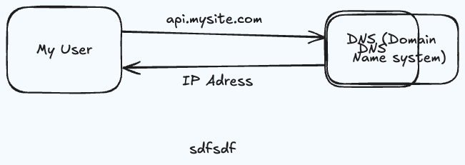

# Chapter 1: scale from zero to millions of users 

## single server start-up

 

- Task:
    - CPU Bound: Most of the time is spend on performing stateless operation on data.
    - Memory Bound: starved of RAM, hence need to use secondary storage.
    - I/O Bound: Most of the time is spent on waiting for the data to arrive from DB.

- single server setup (all componenets lie on one physical/virtual machine)
    - web server (nginx)
    - application logic (python/django)
    - database 

- For growth of users we need to have multiple servers, so it requires seperating database (data tier) and web/mobile traffic (web tier) so that they can be scaled idependently. 

- Database
    - relational (RDMBS)
    - Non-relational (NoSQL)

- Scaling
    - vertical scaling : More RAM/CPU to a single server.
    - horizontal scaling : More servers.

- Load balancer
    - 
